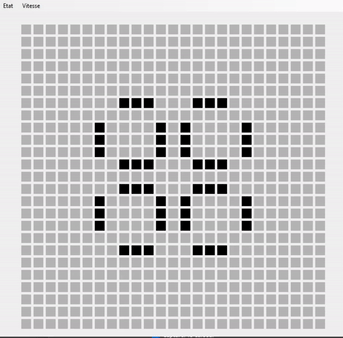
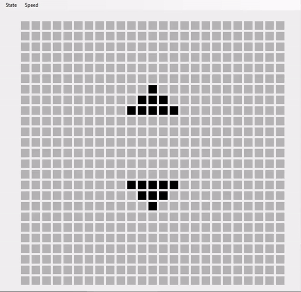
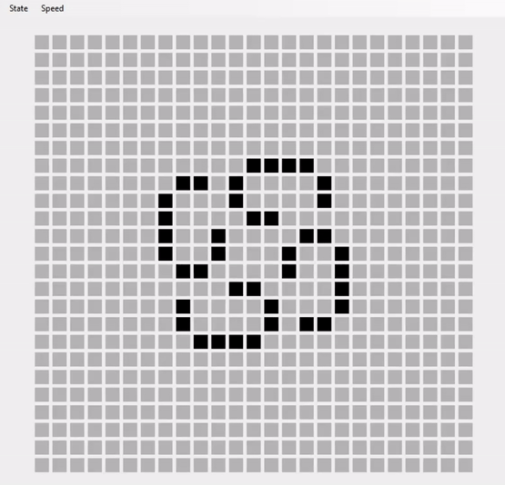
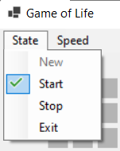
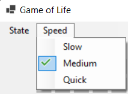

# GameOfLife

  
  

## Description

Program in C# .NET core Windows Forms of Conway's Game of Life for Windows.  
Project made using the IDE Visual Studio 2019.

## Demo

|                  Pulsar                  |              Penta-decathlon              |               Kok's galaxy                |
|:----------------------------------------:|:-----------------------------------------:|:-----------------------------------------:|
|  |  |  |

## Usage

To launch the app, double-click on the GameOfLie.exe file.

In the tab menu, you can reset the app, start the simulation, stop the simulation and restart the app.  

You can also change the speed mode.  
  

## Documentation

Wikipedia:  
[Conway's Game of Life](https://en.wikipedia.org/wiki/Conway%27s_Game_of_Life)

## Contributors

Quentin MOREL :

- @Im-Rises
- <https://github.com/Im-Rises>

