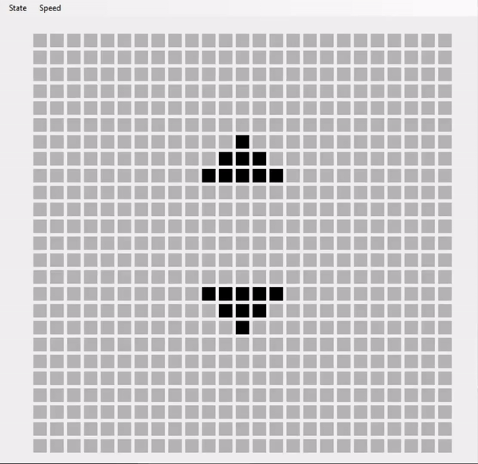
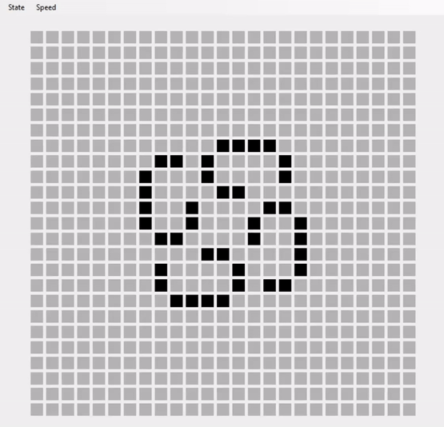
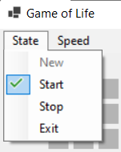
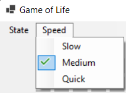

# Conway's Game of Life (Jeu de la vie)

## Description
Program in C# Windows Forms of Conway's Game of Life.
IDE Visual Studio 2019.

## Demo

<table>
  <tr>
    <td>Pulsar</td>
    <td>Penta-decathlon</td>
    <td>Kok's galaxy</td>
  </tr>
  <tr>
    <td></td>
    <td></td>
    <td></td>
  </tr>
  </tr>
</table>

## Usage
To launch the app, double-click on the GameOfLie.exe file.  
In the tab menu, you can reset the app, start the simulation, stop the simulation and restart the app.  

You can also change the speed mode.  

